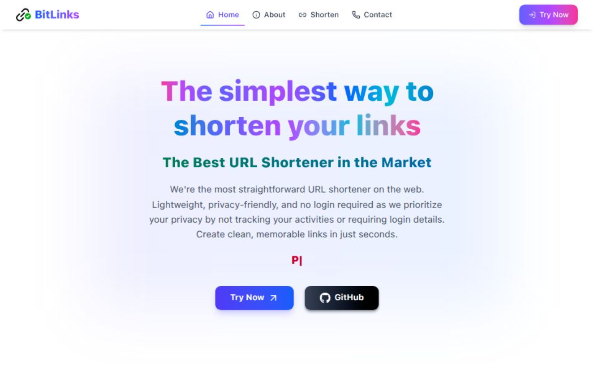
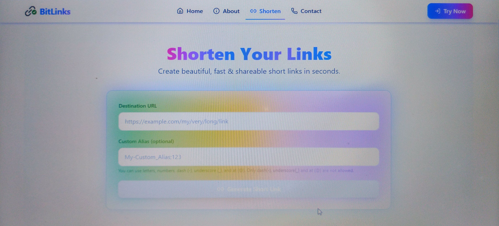

[](./LICENSE)
[](https://bitlinks-jet.vercel.app/)

# BitLinks 🔗

> ⚠️ **IMPORTANT NOTICE**  
> This project is **source-available**, NOT open-source.  
> Deployment, redistribution, rebranding, or reuse is strictly prohibited  
> without explicit written permission from the author.

---

## 🚀 About the Project
**BitLinks** is a modern **URL Shortener** built using **Next.js** and **MongoDB**. It allows users to shorten long URLs into clean, shareable links and manage them easily with a smooth, user-friendly interface.

🔗 **Live Demo:** [BitLinks](https://bitlinks-jet.vercel.app/)

---

## ✨ Features
- 🔗 Instantly shorten long and complex URLs into clean, shareable links.
- 🧩 Create **custom aliases** for your shortened URLs.
- 📊 Track total clicks and manage your URLs effectively. *(coming soon!)*
- 🗑️ Delete shortened links whenever you want.
- 🎨 Fully **responsive** and **modern UI** built with Tailwind CSS.

---

## 🛠️ Tech Stack
- **Frontend:** [Next.js](https://nextjs.org/) + [React](https://react.dev/)
- **Backend:** [Next.js API Routes](https://nextjs.org/docs/app/building-your-application/routing/route-handlers)
- **Database:** [MongoDB](https://www.mongodb.com/)
- **Deployment:** [Vercel](https://vercel.com/)
- **Styling:** [Tailwind CSS](https://tailwindcss.com/)

---

## 📦 Installation & Setup

> ⚠️ This section is provided **only for learning and contribution purposes**.  
> Deployment or production use is **not allowed**.

Clone the repository:
```bash
git clone https://github.com/2000Deba/BitLinks.git
cd BitLinks
```

Install dependencies:
```bash
npm install
```

Run the development server:
```bash
npm run dev
```

The app will be running at:
```
http://localhost:3000
```

---

## 🔑 Environment Variables

Create a `.env.local` file in the root directory and add the following:

```env
MONGODB_URI=your_mongodb_connection_string
NEXT_PUBLIC_BASE_URL=http://localhost:3000
```

> Make sure to replace `your_mongodb_connection_string` with your actual MongoDB connection URI.

---

## 📸 Screenshots

### Home Page


### Shorten URL Page


---

## 🤝 Contributing

Contributions are welcome! 🚀

1. **Fork** the project
2. **Create a branch**: `git checkout -b feature/new-feature`
3. **Commit your changes**: `git commit -m 'Add new feature'`
4. **Push to the branch**: `git push origin feature/new-feature`
5. **Open a Pull Request**

---

## 📦 Deployment Notes

- This project is deployed on **Vercel** for personal and demonstration purposes.

- Due to encryption keys, authentication providers, and email configurations,
this repository is **not intended for public or private redeployment under any name, domain, or branding**.

## 🔐 Usage Policy

- Viewing and learning: ✅ Allowed

- Contributions (PRs): ⚠️ Allowed (all contributions become property of the author).

- By submitting a pull request, you agree that your contribution
becomes part of the project and is subject to the same license terms.

- Forking: ⚠️ Allowed by GitHub, not permission to reuse

- Deployment / Rebranding / Commercial use: ❌ Not allowed

All forked copies remain bound to the same license terms.


---

## 📜 License

This project is **source-available under a custom license**.
It is **NOT open-source**.

You are allowed to view and contribute to this repository for learning
and contribution purposes only.

❌ Reuse, redistribution, rebranding, modification, or commercial use is **not allowed**
without explicit permission from the author.

Modification is allowed only for local learning or contribution purposes.
Modified versions may NOT be deployed, redistributed, or published.

See the [LICENSE](./LICENSE) file for full legal terms and details.

---

## 👨‍💻 Author

**Debasish Seal**

- GitHub: [@2000Deba](https://github.com/2000Deba)
- Portfolio: [Portfolio](https://debasishseal.vercel.app/)
- Live Demo: [BitLinks](https://bitlinks-jet.vercel.app/)

---

### ⭐ Support

Don't forget to ⭐ star this repo if you like it!

For bugs or feature requests, feel free to open an issue.